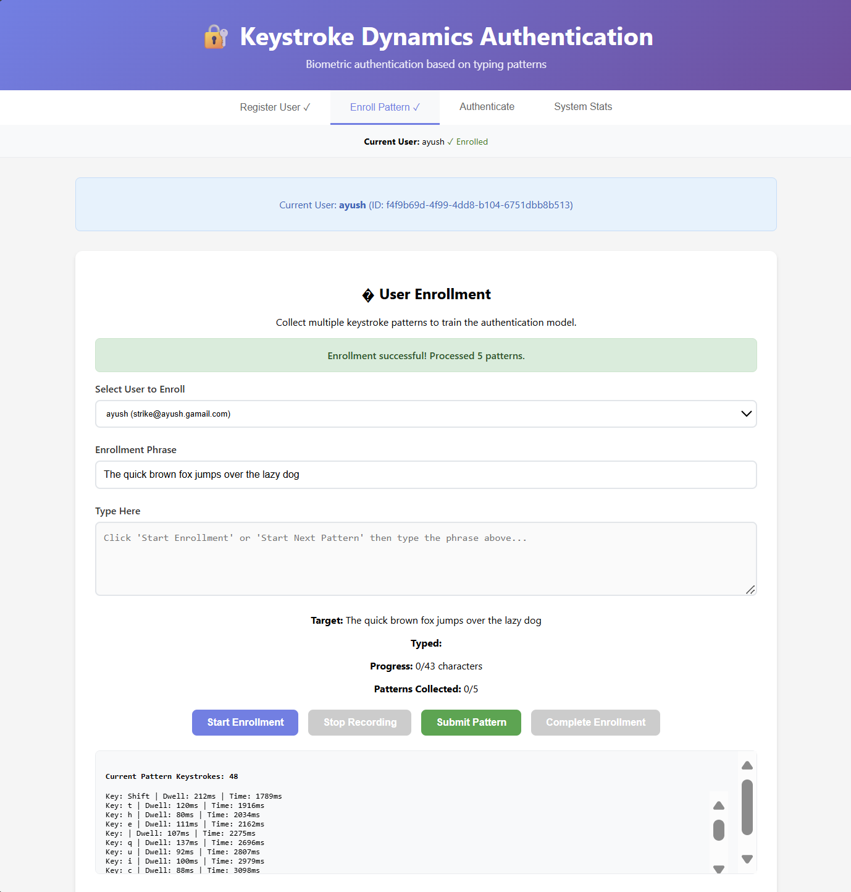
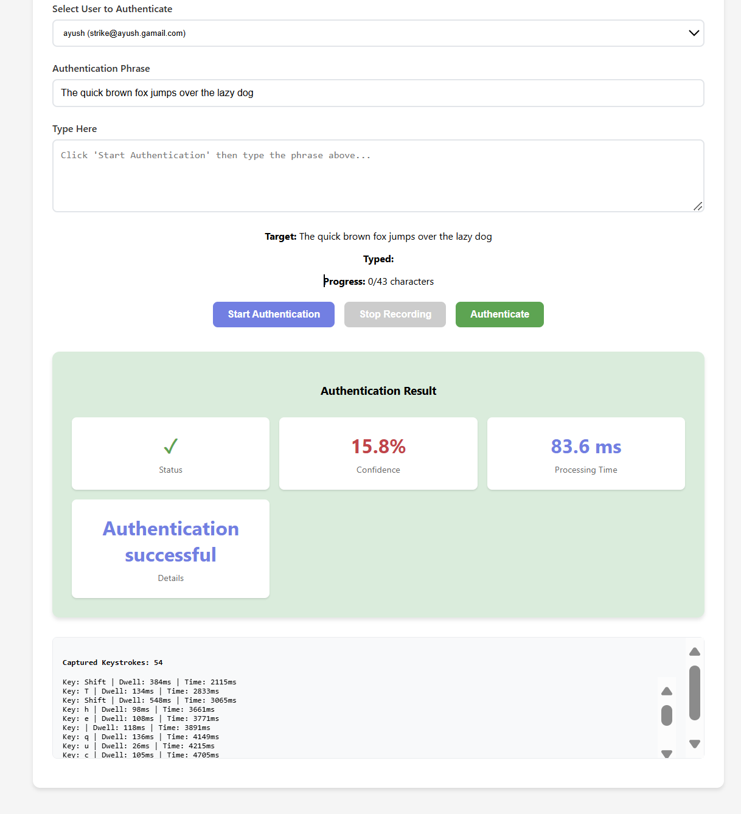

# Keystroke Dynamics Authentication - Frontend

React-based frontend for the Keystroke Dynamics Authentication System. This application provides a modern, intuitive interface for user registration, keystroke pattern enrollment, and biometric authentication.

## 🚀 Features

- **User Registration**: Clean interface for creating new user accounts
- **Keystroke Pattern Enrollment**: Real-time progress tracking during pattern collection
- **Authentication Interface**: Secure login with keystroke verification
- **Real-time Feedback**: Live display of authentication results and confidence scores
- **Modern UI Design**: Purple gradient theme with responsive layout
- **Performance Metrics**: Display of processing times and system statistics

## 📱 Screenshots

### User Registration Interface


### Keystroke Enrollment Process




### Authentication Process



## 🛠️ Development

### Prerequisites
- Node.js 16+ 
- npm or yarn

### Installation
```bash
npm install --legacy-peer-deps
```

### Available Scripts

#### `npm start`
Runs the app in development mode at [http://localhost:3000](http://localhost:3000).
The page will reload when you make changes.

#### `npm test`
Launches the test runner in interactive watch mode.

#### `npm run build`
Builds the app for production to the `build` folder with optimized performance.


## 🏗️ Project Structure

```
src/
├── components/
│   ├── SystemStats.js          # System performance metrics
│   ├── UserAuthentication.js   # Login with keystroke verification
│   ├── UserEnrollment.js       # Keystroke pattern training
│   └── UserRegistration.js     # User account creation
├── hooks/
│   └── useKeystrokeCapture.js  # Custom hook for capturing typing patterns
├── services/
│   └── api.js                  # Backend API communication
├── App.js                      # Main application component
├── App.css                     # Global styles and theme
└── index.js                    # Application entry point
```

## 🎨 Styling

The application uses a modern purple gradient theme with:
- Clean, minimalist design
- Responsive layout for all screen sizes
- Real-time visual feedback during interactions
- Professional color scheme with purple gradients
- Smooth animations and transitions

## 🔌 API Integration

The frontend communicates with the FastAPI backend through:
- RESTful API calls for user management
- Real-time keystroke data transmission
- Authentication result processing
- System statistics display

## 🚀 Getting Started

1. **Start the backend server** (ensure it's running on port 8000)
2. **Install dependencies**: `npm install --legacy-peer-deps`
3. **Start development server**: `npm start`
4. **Open browser**: Navigate to [http://localhost:3000](http://localhost:3000)

## 📈 Performance

- **Lightweight bundle**: Optimized React components
- **Fast rendering**: Efficient state management
- **Real-time updates**: Immediate feedback during authentication
- **Cross-browser compatibility**: Works on all modern browsers

## 🤝 Contributing

When adding new features:
1. Create new components in `src/components/`
2. Add API calls to `src/services/api.js`
3. Use the established styling patterns
4. Test on multiple screen sizes

Built with ❤️ using React and modern web technologies.
